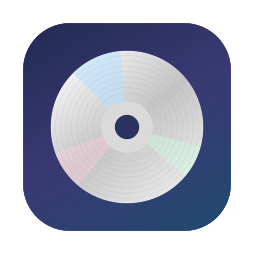
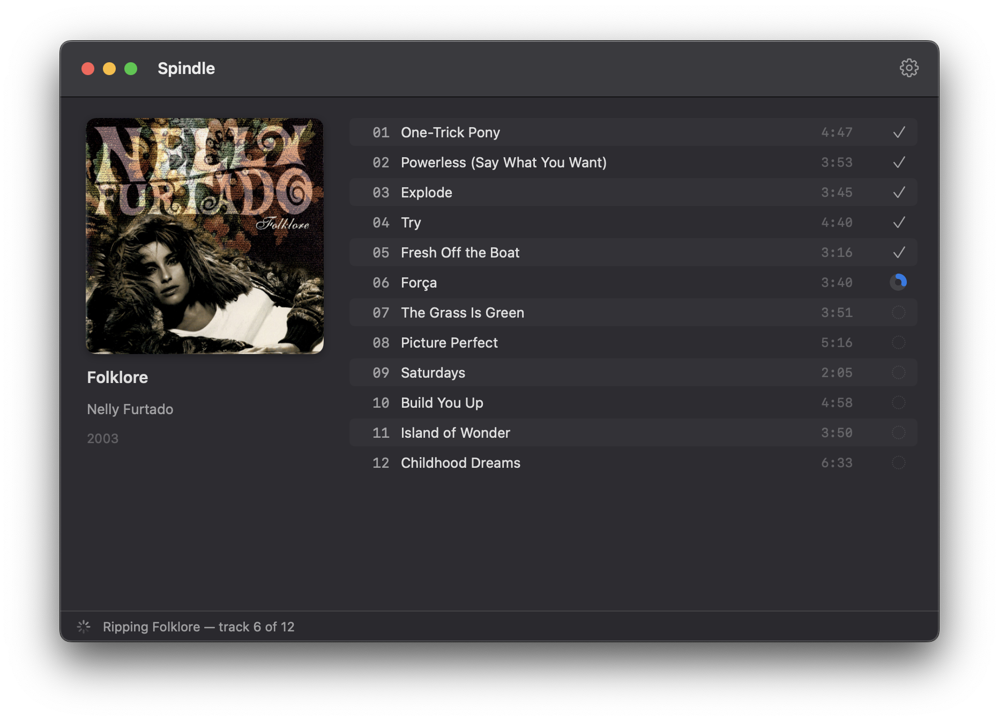

<div align="center">



# Spindle

**Accurate, hands-off CD ripping for macOS.**

Insert a disc — Spindle rips it accurately, tags it with MusicBrainz metadata
and cover art, encodes to FLAC, ALAC, or AAC, delivers the album to a local
folder or SFTP server (a Navidrome host, for example), and ejects so you can
feed it the next disc.

[](https://github.com/thijsw/spindle/actions/workflows/ci.yml)
[](https://github.com/thijsw/spindle/releases/latest)




</div>

## Download

Download the latest signed, notarized `.dmg` from the
[**Releases**](https://github.com/thijsw/spindle/releases/latest) page, open it,
and drag **Spindle** into Applications. Requires macOS 14 or later.

Each release is built and packaged automatically by GitHub Actions — see
[`docs/RELEASING.md`](docs/RELEASING.md) for how to cut one.

## How it works

- **Accurate ripping** — Spindle reads raw CDDA sectors through the macOS
  IOKit CD ioctls with C2 error pointers. Damaged sectors are re-read until
  consecutive reads agree; drives without C2 fall back to read-twice-compare.
  Unreadable tracks are abandoned after a per-track time budget so a batch
  keeps moving. Per-drive read-offset correction is supported, and every rip
  is verified against the public
  [CUETools Database](http://cue.tools/wiki/CUETools_Database).
- **Metadata** — the MusicBrainz DiscID is computed from the disc TOC and
  looked up on MusicBrainz (with fuzzy TOC fallback and CD-TEXT as a last
  resort). When several pressings match, Spindle asks you to pick — without
  pausing the rip. For a disc MusicBrainz doesn't know, you can hand-edit the
  album and per-track tags in a built-in editor, or have Spindle tag it as
  "Unknown" and keep going unattended — your choice in Settings. Either way
  only the encode waits; the rip and eject still proceed. Cover art comes from
  the Cover Art Archive with an iTunes fallback.
- **Encoding** — FLAC, ALAC, or AAC (256 kbps), one format per rip, chosen in
  Settings. Every format carries the full Picard-compatible tag set and
  embedded cover art; FLAC additionally gets a correct PCM MD5 in its
  STREAMINFO. Files are named by a configurable template,
  `Artist/Album (Year)/01 - Title.flac` by default. Each album folder can also
  receive an archival rip log, a `.cue` sheet, and a `cover.jpg`.
- **Delivery** — to a local folder (which covers Finder-mounted SMB/NFS NAS
  shares) or over SFTP. Uploads go to a `.part` name and are renamed on
  completion so library scanners never see partial files. Secrets live in
  the Keychain.

Spindle is a Developer ID app, not sandboxed: the App Store sandbox does not
permit the raw drive access accurate ripping requires.

## Building

Requires macOS 14+ to run and Xcode 16+ to build.

The app lives in `Spindle.xcodeproj` (open it and hit Run); all logic lives
in the `SpindleCore` local Swift package.

```sh
open Spindle.xcodeproj                  # develop in Xcode
(cd SpindleCore && swift test)          # Swift Testing suite, headless
Scripts/make-app.sh                     # assemble dist/Spindle.app (Debug)
Scripts/make-app.sh release             # universal Release build
```

### Release packaging

```sh
SIGN_IDENTITY="Developer ID Application: Your Name (TEAMID)" Scripts/make-app.sh release
Scripts/notarize.sh             # needs a notarytool keychain profile
Scripts/make-dmg.sh
```

## Development CLI

Every subsystem is exercisable headless via `spindle-cli` (run from
`SpindleCore/`):

```sh
swift run spindle-cli detect            # watch disc insertions
swift run spindle-cli toc               # print the table of contents
swift run spindle-cli discid            # MusicBrainz DiscID for the disc
swift run spindle-cli identify --pick 1 # MusicBrainz lookup (+ --toc for discless testing)
swift run spindle-cli rip --out rip     # secure rip + CTDB verification
swift run spindle-cli scan-offset rip   # find the drive's read offset via CTDB
swift run spindle-cli encode rip --toc "…" --format flac   # flac, alac, or aac
swift run spindle-cli push library --to sftp://user@host/srv/music
```

## Architecture

`Spindle.xcodeproj` builds the thin SwiftUI app shell in `Spindle/`; the
`SpindleCore/` package holds everything else:

| Module | Purpose |
| --- | --- |
| `CIOCD` | C shim for the IOKit CD ioctls (DKIOCCDREAD &c.) |
| `DiscDrive` | Drive monitoring (DiskArbitration), TOC parsing, raw device access |
| `RipEngine` | Secure/burst rip loop, offset correction, checksums, WAV staging |
| `Metadata` | DiscID, MusicBrainz WS/2, release scoring, Cover Art Archive, CD-TEXT |
| `Verification` | CUETools DB client and rip verdicts |
| `Encoding` | Core Audio FLAC/ALAC/AAC encoders + pure-Swift FLAC tagger |
| `Naming` | Filename templates and path sanitization |
| `Transfer` | Local-folder and SFTP destinations, Keychain |
| `SpindleCore` | The pipeline coordinator orchestrating all of the above |
| `Spindle/` (app) | SwiftUI shell: main window, release picker, tag editor, Settings |

Dependencies: [Citadel](https://github.com/orlandos-nl/Citadel) (MIT) for SFTP.
Everything else is Apple frameworks.

## Authorship

The vast majority of this codebase — Swift sources, tests, build scripts, CI,
and this README — was written by Claude (Anthropic's LLM), working from the
project's design and human direction and review. If you're reading the code,
keep that in mind: treat it with the same scrutiny you'd give any
machine-generated work, and please report anything that looks off.

## License

© 2026 Thijs Wijnmaalen. All rights reserved (for now).
